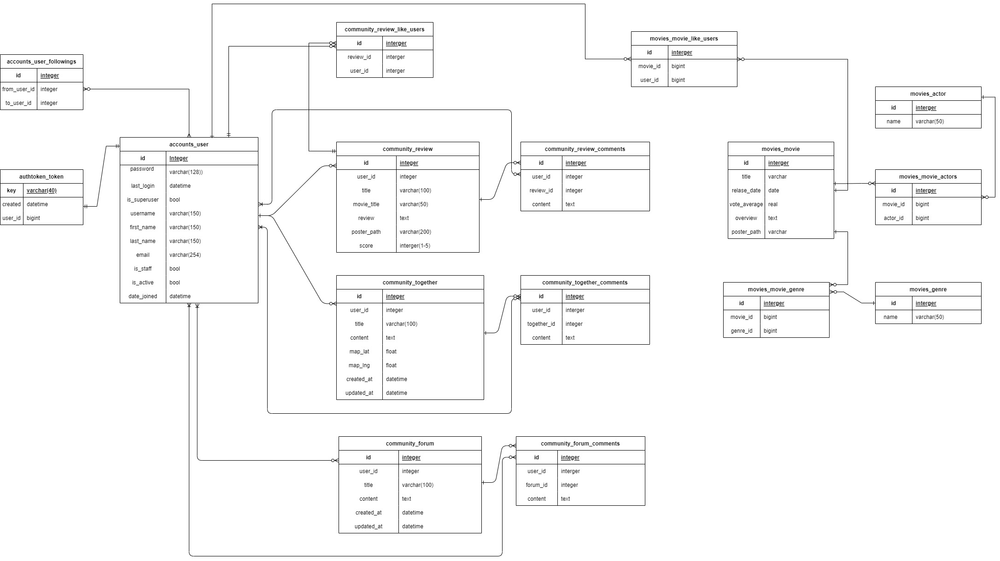
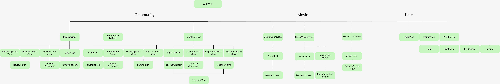
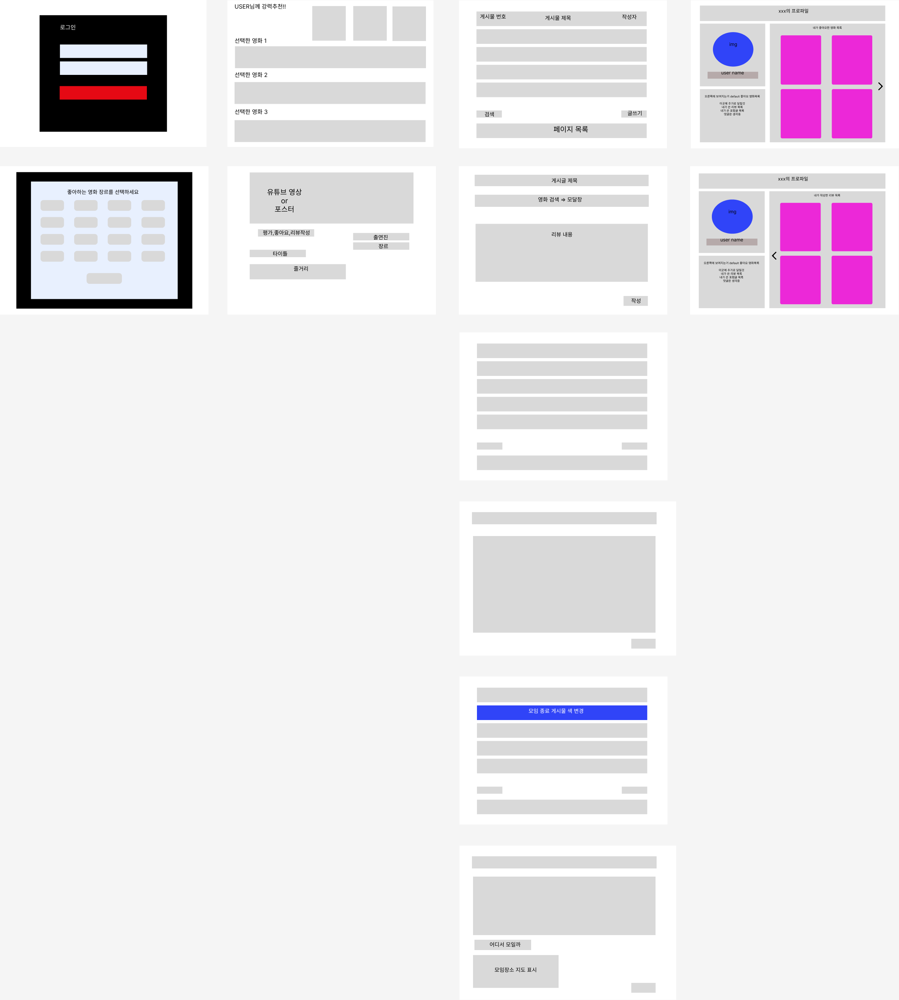
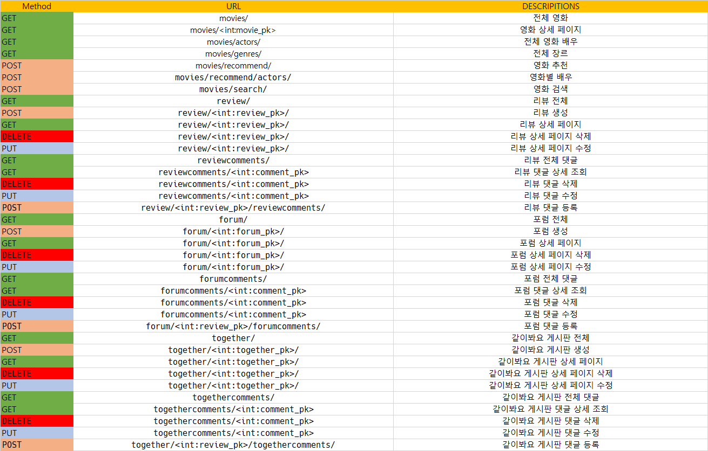
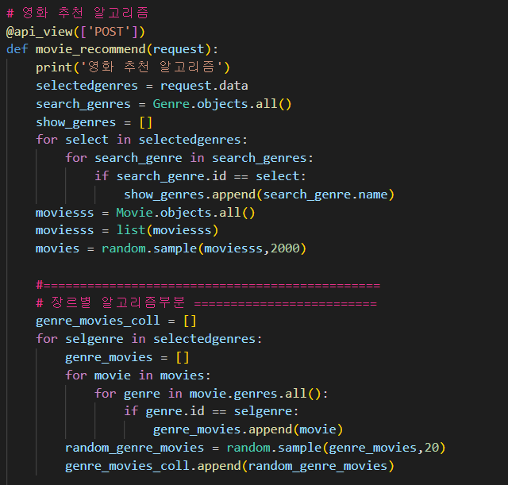
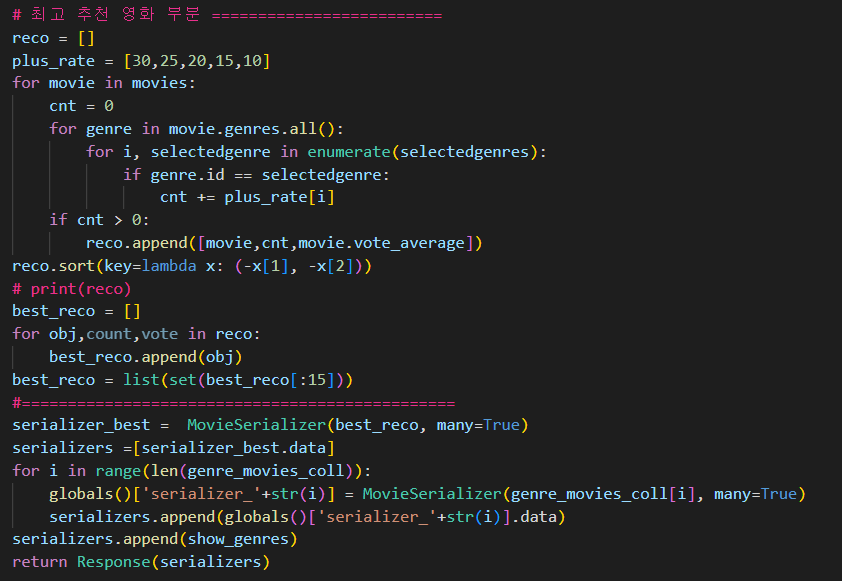
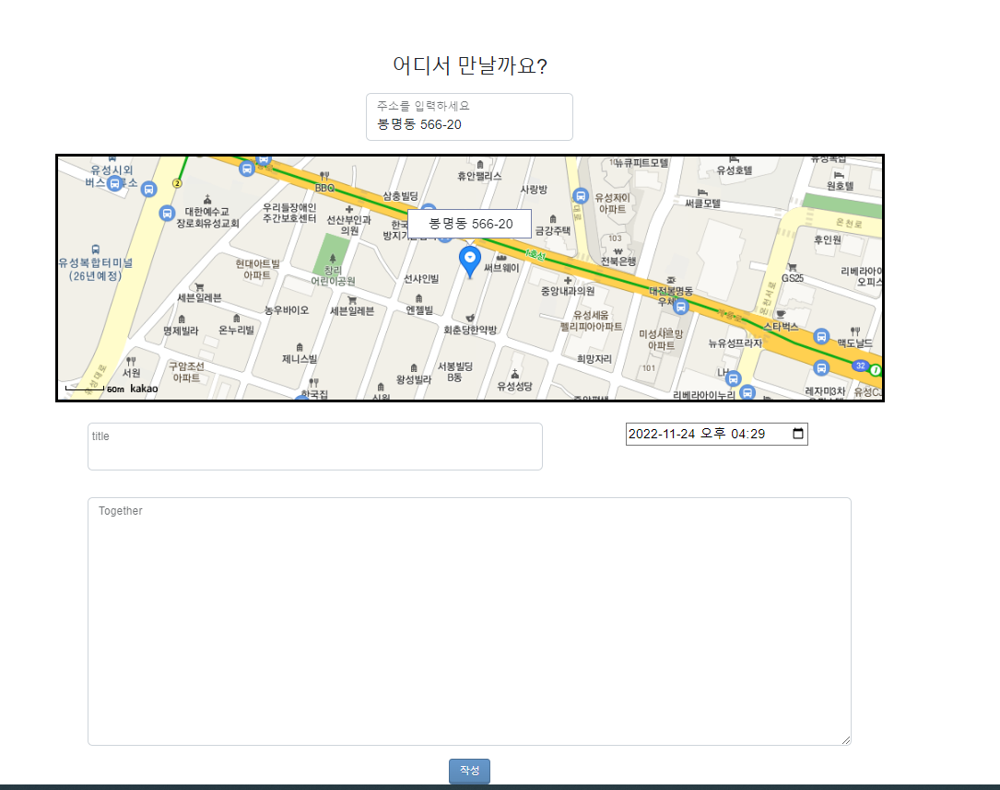
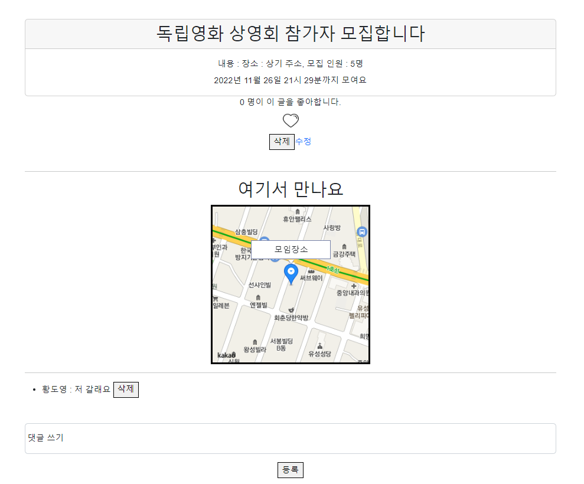

# 최종 README

진행상황: 🤝 리드미

# 팀원

- 배상현
  - 백엔드
    - DB모델링
    - 영화 추천 알고리즘(장르별)
    - 시리얼라이저 최적화
  - 프론트엔드
    - 카카오 맵 api 호출
    - 추천영화 페이지
- 황도영
  - 백엔드
    - DB모데링
    - [view.py](http://view.py) 작성, api 생성
    - 영화 추천 알고리즘(가중치)
  - 프론트엔드
    - 카카오 맵 api 위치정보 저장

# 구현 목표 서비스

### 백엔드(유저)

필수 구현 기능

- dj-rest-auth 에서 제공하는 유저 CRU기능 + nickname 추가
- 유저 D 기능 구현

도전 구현 기능

- 소셜 로그인 기능
- 이메일 인증

### 백엔드(영화)

필스 구현 기능

- TMDB 에서 영화 가져와서 JSON 에 데이터 저장
- 영화 추천 알고리즘

### 백엔드(커뮤니티)

필수 구현 기능

- 커뮤니티 게시판 삼중화(자유게시판, 리뷰게시판, 구해요 게시판)
- 댓글
- 내가 작성한 게시글, 댓글만 수정, 삭제 가능
- 리뷰 작성시 영화 제목 검색 후 선택하면 포스터 이미지 추가(MovieSearch)

도전 구현 기능

- 지도 API 통한 위치 마킹
  - 구해요 게시판 영화모임, 영화 같이보기 위치 표현
- 대댓글

### 프론트엔드(유저)

필수 구현 기능

- 팔로잉, 팔로워
- 좋아요 한 영화 보여주기
- 유저 정보(닉네임) 을 이용한 환영인사

도전 구현 기능

- 프로필 이미지

### 프론트엔드(영화)

- 로그인 페이지
  - 홈페이지 이용시 로그인 필수
  - 로그인 하면 메인페이지로 이동
- 메인페이지 1
  - 사이트에 입장하면 영화 장르를 선택할 수 있게 함
  - 추천영화 가져오는 과정에서 로딩창 보여주기
- 메인페이지 2
  - 강력추천 영화
  - 선택한 장르의 영화
  - 슬라이드에 마우스 올려두면 강조
  - 이미지를 선택하면 디테일 페이지로 이동할 수 있음
- 디테일 페이지
  - 디테일 페이지는 모달으로 구성
  - 디테일 페이지 상단에는 유튜브 영상 재생 가능하게 함(유튜브ID가 없다면 이미지)
  - 영화 정보(제목, 평점, 출연진, 기타등등)
  - 모달창 안에서 바로 리뷰 작성으로 이동 가능
    - 디테일에서 바로 리뷰를 작성하면 영화 정보 넘겨주기

### 프론트엔트(커뮤니티)

- 게시판 공통
  - 글 번호, 제목, 작성자 보여주기
  - 한 페이지에 10~15개 정도의 게시글
  - 페이지 나누기
- 구해요 게시판
  - 모임 종료시간이 끝나면 종료된 모임의 게시글 색을 변경

# 완성 서비스

- 백엔드
  - 닉네임 기능
  - 회원 탈퇴 기능
  - Api 를 통해 TMDB 영화 데이터 수집 후 fixtures 저장
  - 영화 추천 알고리즘
  - 커뮤니티 게시판 삼중화(자유게시판, 리뷰게시판, 구해요 게시판)
  - 댓글 수정, 삭제
  - 리뷰 작성 시 영화 디테일 페이지에서 직접 접근하면 제목과 포스터 이미지 추가
  - 카카오 지도 주소 검색을 통한 위치 이동
  - 카카오 지도 주소 검색을 통한 위치 마킹
  - 카카오 지도 주소 검색을 통해 게시물에 지도 저장
  - 랜덤 유저 프로필 이미지
- 프론트 엔드
  - 로그인 페이지
    - 홈페이지 이용시 로그인 필수
    - 로그인 하면 메인페이지로 이동
  - 메인페이지 1
    - 사이트에 입장하면 영화 장르를 선택할 수 있게 함
    - 추천영화 가져오는 과정에서 로딩창 보여주기
  - 메인페이지 2
    - 강력추천 영화
    - 선택한 장르의 영화
    - 슬라이드에 마우스 올려두면 강조
    - 이미지를 선택하면 디테일 페이지로 이동할 수 있음
  - 디테일 페이지
    - 디테일 페이지는 모달으로 구성
    - 디테일 페이지 상단에는 유튜브 영상 재생 가능하게 함(유튜브ID가 없다면 이미지)
    - 영화 정보(제목, 평점, 출연진, 기타등등)
    - 모달창 안에서 바로 리뷰 작성으로 이동 가능
      - 디테일에서 바로 리뷰를 작성하면 영화 정보 넘겨주기
  - 글 번호, 제목, 작성자 보여주기

# 미완성 서비스

- 백엔드
  - 소셜 로그인 기능
  - 이메일 인증 기능
  - 내가 작성한 게시글, 댓글만 정보 변경 가능
  - 대댓글
- 프론트엔드
  - 팔로잉 팔로워
  - 유저 정보를 이용한 환영 인사
  - 게시판 페이지네이션
  - 구해요 게시판 종료시간이 지나면 자동으로 게시물 색 변경

# ERD

# Vue component

# mockup

# API

# 영화 추천 알고리즘

공통 부분

⇒ 선택한 장르를 리스트에 저장

⇒ 모든 장르를 확인

1. 장르별 추천 알고리즘
   - 선택한 장르를 특정 배열에 저장 순서대로 확인
   - 장르가 일치하는 영화를 genre_movies 배열에 저장
   - genre_movies 배열에서 랜덤으로 20개의 영화를 추출
2. 베스트 영화 추천 알고리즘
   - 최대 5개의 영화의 장르를 선택
   - 모든 영화에서 선택한 장르와 일치하는 영화를 확인
   - 배열 요소의 담긴 순서대로 가중치를 누적
   - 가중치가 가장 높고, 평점 평균이 가장 높은 순으로 정렬
   - 최대 15개의 영화를 확인 가능

# 서비스 대표 기능

- 모여요 게시판

카카오 맵 Api 를 활용해서 게시글 작성 시 주소 확인 가능

# 후기

- 황도영
  
  - 카카오 맵 api를 만만하게 봤다가 큰코다쳤다 프로젝트 기간 중 집에가서 계속 새벽 2~3시 까지 카카오만 붙잡고 있었는데 Vue로 만든 자료들이 생각보다 많지 않았고 분명 이렇게 하는게 맞는데 안되는 경우가 있었다. 혼자서 한참 들여다 보다가 상현이 형과 같이 쳐다보니까 해결책이 눈에 보였고 결국 해결 할 수 있었다. 추후에 문제가 생기긴 했지만 어쨌든 해결했다.
  - 관통 프로젝트를 진행하면서 그래도 나름 Vue 사용법 정도는 익힌 것 같다. Vue 수업시간이 짧기도 했고 개인적으로 몸이 좋지 못해서 개념 정도만 알고 막상 코드로 옮기려면 어려움이 많았었는데 이번에 기능도 구현하고 여러모로 Vue를 사용할 수 있는 좋은 기회가 된 것 같다.  다음학기엔 리액트를 쓰겠지만….
  - 몸이 작살난다 잠을 못자니까 계속 카페인을 수혈 해 주어야 한다. 그래도 죽을 것 같다…
  - 프로젝트 사이즈를 작게 만들라는 이유가 뭐 때문인지 알게됐다. 처음에는 게시판 3개 별거 아니네? 했는데 막상 구현 하다보니 각각 게시판 마다 미묘하게 달라서 손이 많이 가고 수정할 부분이 많았다.
  - 프로젝트를 진행하면서 개인적으로 많이 아쉬웠던 부분이 디자인 >>>>>>> (넘사벽) >>> 기능 이라는 점 이였다. 물론 CSS/HTML 도 중요하지만 디자이너가 아닌 개발자를 지망하는 사람들이 모여서 프로젝트를 진행하는데 CSS 하기가 겁나서 기능 구현을 망설이는건 어불성설 인 것 같다.

- 배상현
  
  - 시작은 창대하게 라는 말이 맞게 처음엔 많은 계획을 세웠고 여러 기능들을 넣으려고 했었다. 하지만 생각만으로는 할만해 보였던 서비스들이 막상 구현을 하고 vue에 표현을 하려고보니 쉽지 않았다.
  - 장고는 원래 자신이 있었던 분야라 백은 빨리 끝났지만 프론트가 문제였다. 뷰를 짧은시간동안 배우기도 했지만 내가 학습을 많이 안한게 문제 같았다.
  - 카카오 api 비동기때문에 상당히 골치가 많았었다. promise와 async를 이용하여 해결하긴 했지만 이 부분은 나중에 추가학습으로 공부하고싶다.
  - 기능에 치중해 css와 배포를 못한게 너무 아쉽다. 또한 소셜로그인도 꼭 해보고 싶은 기능이었는데 이것도 아쉽다.
  - 프로젝트를 진행하면서 도영이와 합숙도하고 항상 같이했었는데 확실히 이렇게하는게 효율이 좋고 의사소통이 쉬워 여러 문제를 빠르게 해결할 수 있었다.
  - 비록 짧은시간이었지만 여러가지를 배울 수 있었고 내가 부족한게 css임을 깨닫고 공부 계획을 세울 수 있게 됐다.